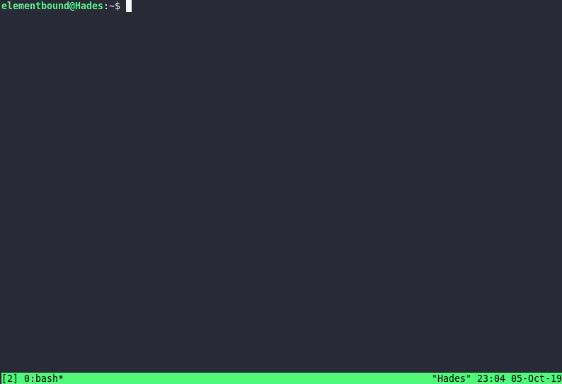

# mdview #

View Markdown files in your terminal!



## Requirements ##

* [node.js](https://nodejs.org/en/download/)
* [lynx](https://lynx.browser.org/)
* [imagemagick](https://imagemagick.org/)

## Install ##

Install `lynx` and `imagemagick` with your package manager of choice. For example: 

```sh
sudo apt install lynx imagemagick
```

Install `mdview` from Github, using `npm`:

```sh
npm install -g https://github.com/elementbound/mdview.git
```

## Usage ##

Open any markdown file with `mdview`:

```sh
mdview README.md
```

## Configuration ##

The server can be configured via environment variables, of which there's only one at the moment:

* `MDSERVE_PORT` - Listen on this port
  * If you override this, it is recommended to do so from your `.profile` or similar.
  * If you only override it for running `mdserve`, running `mdview` will look for the service on the wrong port and start it again.

> NOTE: The server only accepts requests from the local machine.

## Documentation ##

This package provides two components - `mdview` and `mdserve`.

`mdserve` is a HTTP server that renders markdown documents as HTML. It includes image conversion logic as well, so images show up in some way. 

`mdview` launches `mdserve` when needed, and opens the given document in `lynx`.