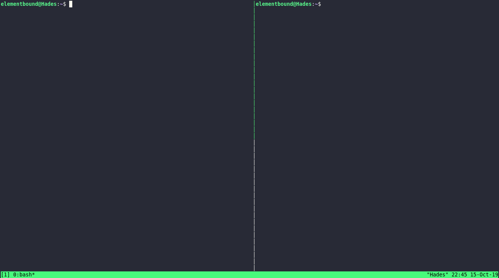

# mdview #

View Markdown files in your terminal!


## Features ##

* Open Markdown files in your terminal
* Follow links between the files
* Unknown files are presented as-is
* Render images as ASCII grayscales
* Configure via environment variables

## Requirements ##

* [node.js](https://nodejs.org/en/download/)
* A text-mode browser, such as:
  * [lynx](https://lynx.browser.org/)
  * [w3m](http://w3m.sourceforge.net/)
  * [links2](http://manpages.ubuntu.com/manpages/disco/en/man1/links2.1.html)
  * [elinks](http://elinks.or.cz/)
* [imagemagick](https://imagemagick.org/)
  * Only needed for image rendering, can be turned off. See [configuration](.env.defaults)

## Install ##

Install `lynx` and `imagemagick` with your package manager of choice. For example: 

```sh
sudo apt install lynx imagemagick
```

Install `mdview` using `npm`:

```sh
npm install -g @elementbound/mdview
```

## Usage ##

Open any markdown file with `mdview`:

```sh
mdview README.md
```

## Documentation ##

This package provides two components - `mdview` and `mdserve`.

`mdserve` is a HTTP server that renders markdown documents as HTML. It includes image conversion logic as well, so images show up in some way. 

`mdview` launches `mdserve` when needed, and opens the given document in the configured browser ( default is `lynx` ).

### Command line flags ###

| Flag | Description                     |
| ---- | ------------------------------- |
| `-q` | Don't output anything to STDOUT |

### Endpoints ###

| URL              | Description                          |
| ---------------- | ------------------------------------ |
| `/render/{path}` | Render the file under `path` as HTML |
| `/ping`          | Returns `pong` if the server is up   |
| `/pid`           | Returns the server's process ID      |

> NOTE: The server only accepts requests from the local machine.

### Tips and tricks ###

#### Periodically refreshing file ###

You can combine `mdview`'s *quiet* flag, your browser's *dump* flag, and the `watch` command:

```sh
watch -n 0.5 'MDVIEW_BROWSER="lynx -dump" mdview -q /path/to/file'
```

If you have a version of `watch` that supports it, you can use `elinks` for colored output:

```sh
watch -n 0.5 --color 'MDVIEW_BROWSER="elinks -dump -dump-color-mode 1" mdview -q /path/to/file'
```

Here it is in action:



## Configuration ##

The server can be configured via environment variables. Which also means that you can plop your variables in your `.bashrc` or similar.

For reference, see [`.env.defaults`](.env.defaults)

## Issues ##

If you have any issues or feedback, please feel free to let me know by opening an [issue on Github](https://github.com/elementbound/mdview/issues).